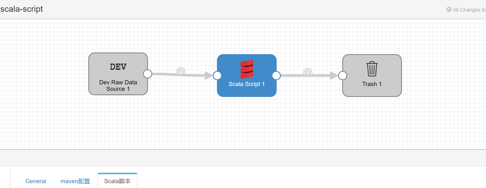
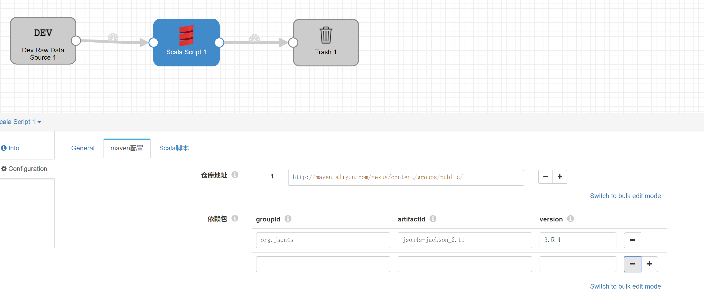
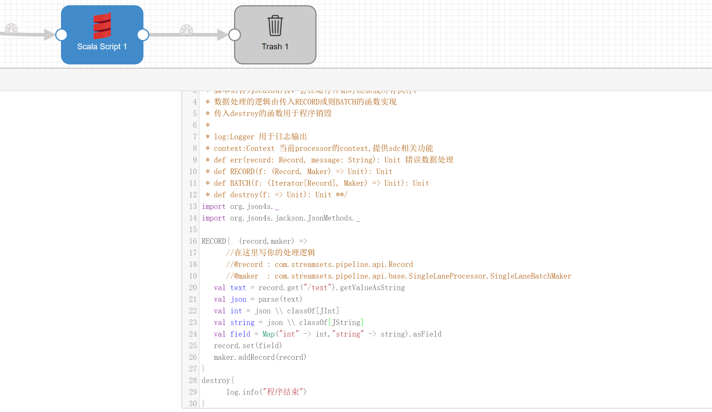
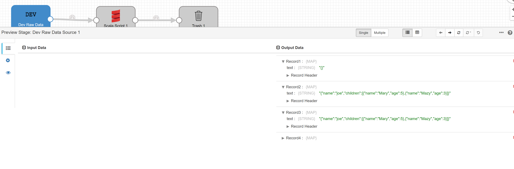
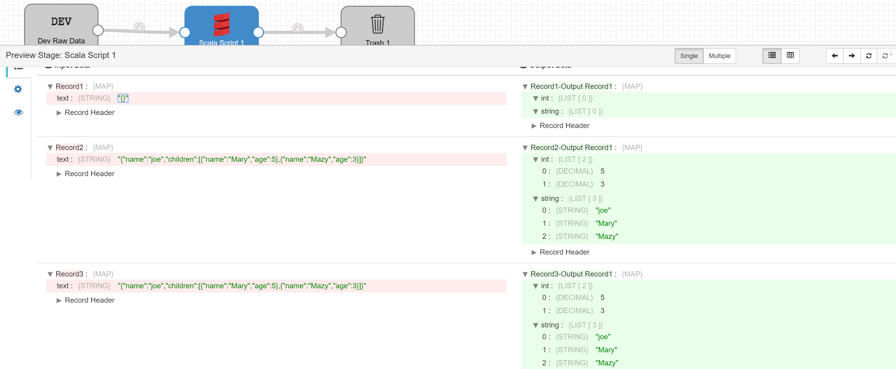

# streamsets-scala-script

在streamsets中使用scala脚本

```shell
mvn package
cd target/
# 上传streamsets-scala-script-1.0-SNAPSHOT.tar.gz至streamsets-libs下
tar -xzvf streamsets-scala-script-1.0-SNAPSHOT.tar.gz
# 重启sdc
```

**注意：不可以解压到`user-lib`,必须放在`streamsets-libs`目录下，否则会出现classloader无法获取**

`com.streamsets.datacollector.runner.PipelineRuntimeException: CONTAINER_0800 - Pipeline 'scalascript898cc1c7-c56a-48fd-9c10-b44baaecd0ae' validation error : CONTAINER_0701 - Stage 'ScalaScript_01' initialization error: java.security.AccessControlException: access denied ("java.lang.RuntimePermission" "getClassLoader")`

# 示例

`example/scala-script.json`

## pipeline



## 配置依赖



## 执行脚本



## 预览



